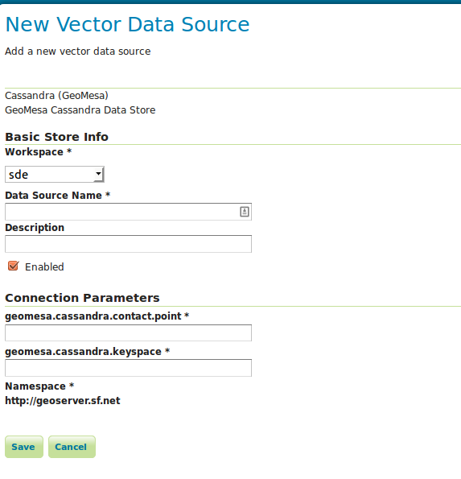

GeoMesa Cassandra DataStore
=====

### Overview
The GeoMesa Cassandra DataStore provides a geotools API backed by Cassandra for geospatial data.  Currently, the
implementation is very much alpha - we are actively soliciting help in making this a robust library for handling
geospatial data within Cassandra.  See the note below on things to do and ways you can help out.

### Limitations
Currently, the Cassandra DataStore only supports point/time data.  Fortunately, the vast majority of high volume 
spatio-temporal datasets are 'event' data which map directly to the supported data type.  Additionally, the Cassandra
DataStore expects queries to have bbox or 'polygon within' and time-between predicates.  Additional predicates on any 
attribute are supported, but they are applied during a post-processing phase.  See the TODO section for how to 
optimize these predicates.
 
### Index Structure
The Cassandra DataStore has a 32-bit integer as the primary key and a 64 bit integer as the clustering key, each with 
the following structure.

 * Partition/Primary Key (pkz)
 
    |Bytes 31...16|Byte 15...0|
    |-------------|-----------|
    |Epoch Week   |10 bit Z2 packed into 16 bits |
 
 * Clustering Key (z31)
 
    | Bytes 63...0    |
    |---------------- |
    |Full Z3          |

The week number since the epoch is encoded in the upper 16 bits of the primary key and a 10 bit Z2 index is encoded
in the lower 16 bits of the primary key.  This results in 1024 (10 bit Z2) primary partition keys per week.  For example,
a spatio-temporal point with lon/lat `-75.0,35.0` and dtg `2016-01-01T00:00:00.000Z` would have a primary key of 
`157286595`. In addition to the primary key, the Cassandra DataStore encodes a Z3 index into the secondary sort index.  The Z3 index interleaves the latitude, longitude, and seconds in the current week into a 64 bit long.  See the TODO section for an
item regarding parameterizing the periodicity (Epoch Week).

### Query planning
In order to satisfy a spatio-temporal query, the Cassandra DataStore first computes all of the row-keys that intersect
the geospatial region as well as the temporal region.  Then, for each coarse geospatial region, the Cassandra DataStore
computes the Z3 intervals that cover the finer resolution spatio-temporal region.  It then issues a query for each
unique row and Z3 interval to get back the result sets.  Each result set is post-processed with any remaining 
predicates on attributes.

### Using the Cassandra DataStore Programmatically
Since the Cassandra DataStore is just another Geotools DataStore, you can use it exactly as you would any other Geotools
DataStore such as the PostGIS DataStore or the Accumulo DataStore.  To get a connection to a Cassandra DataStore, use the ```DataStoreFinder```.

```java
import com.google.common.collect.ImmutableMap;
import org.geotools.data.DataStore;
import org.geotools.data.DataStoreFinder;
import org.locationtech.geomesa.utils.geotools.SimpleFeatureTypes;

import java.io.IOException;
import java.util.Arrays;
import java.util.Map;

Map<String, ?> params = ImmutableMap.of(
   CassandraDataStoreParams.CONTACT_POINT().getName() , "127.0.0.1:9142",
   CassandraDataStoreParams.KEYSPACE().getName()      , "geomesa_cassandra");
DataStore ds = DataStoreFinder.getDataStore(params);
ds.createSchema(SimpleFeatureTypes.createType("test", "testjavaaccess", "foo:Int,dtg:Date,*geom:Point:srid=4326"));
```
### Using the Cassandra DataStore from GeoServer
First, you need to install the geomesa-cassandra-gs-plugin-${VERSION}.jar in the geoserver/WEB-INF/lib directory.  Then, 
restart geoserver and navigate to the ```Add Store``` page and select ```Cassandra Data Store``` as shown below.


In the following page, enter the name and description of the data store, the contact point (HOST:PORT), and the keyspace.  Finally, click submit and you should see all the layers that are in that keyspace available for publishing.  From there, Cassandra DataStore layers act just like any other Geoserver data store.



### How you can contribute
Here's a list of items that we will be adding to optimize the Cassandra DataStore
  * Pushdown predicates - push attribute predicates down into Cassandra rather than applying them in the post-processing
    phase
  * Configurable periodicity - utilizing one-week bounds as the coarse temporal part of the row key is not optimal for 
    all data sets and workloads.  Make the coarse temporal part of the primary key configurable - i.e. day, year, etc
  * Configurable precision in the z3 clustering key - the full resolution z3 index results in a lot of range scans.  
    We can limit the range scans by accomodating lower precision z3 indexes and pruning false positives in a 
    post-processing step.
  * Prune false positives with push-down predicates - if we add the latitude and longitude as columns, we can prune 
    false positives by having two predicates - the first specifying the range on z3 and the second specifying the bounds on x and y.
  * Non-point geometries - support linestrings and polygons
